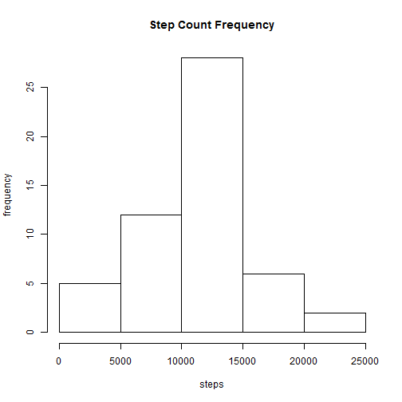
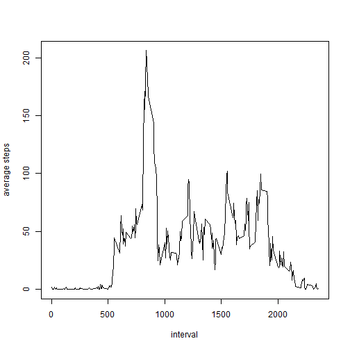
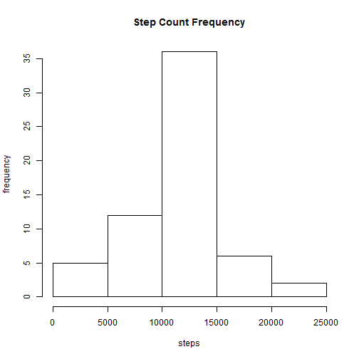
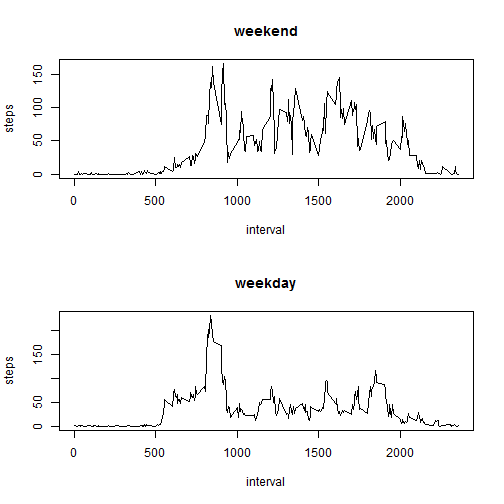

##Load and Preprocess Data  


```r
data <- read.csv("activity.csv")
data_na <- data[!is.na(data$steps),]
```

##Total Steps Per Day


```r
total_steps <- aggregate(data_na$steps, by=list(data_na$date), sum)
hist(total_steps[,2], xlab="steps", ylab="frequency", main="Step Count Frequency")
```

 

```r
mn <- mean(total_steps[,2])
md <- median(total_steps[,2])
```

*Total Steps Per Day*  
mean:   **10766**    
median: **10765**    


##Average Daily Activity


```r
intervals <- split(data_na, f=as.factor(data_na$interval))
im <- lapply(intervals, function(x){mean(x$steps)})
```
*Average steps per interval across all days*

```r
plot(names(im), im, type="l", xlab="interval", ylab="average steps")
```

 

*Interval with maximum average steps*  

```r
max_steps <- names(im[im == max(unlist(im))])[1]
```
Interval: **835**

##Replace Missing Values

Replace missing values using the absolute value  
of the average for the given interval.

```r
replace_na <- function(x) {
    if(is.na(x["steps"])) {
        #strips whitespace intoduced by R
        i = as.character(as.integer(x["interval"]))
        return(im[[i]])
    }
    
    return(x["steps"])
}
```
Replace the existing "steps" column with the newly calculated one:

```r
missing <- sum(is.na(data))
data$steps <- as.integer(apply(data, 1, replace_na))
```
Updated histogram:  

```r
total_steps <- aggregate(data$steps, by=list(data$date), sum)
hist(total_steps[,2], xlab="steps", ylab="frequency", main="Step Count Frequency")
```

 

Recalculate mean and median:


```r
mn2 <- mean(total_steps[,2])
md2 <- median(total_steps[,2]) 
```

*Total Steps Per Day (imputed)*  
mean:   **10749**    
median: **10641** 

**Difference between mean and median for non-imputed and imputed datasets:**

mean: **16.4181874**  
median: **124** 

##Differences In Activity Patterns Detween Weekdays And Weekends

Define a function to split the dataset into weekends and weekdays:


```r
is_weekend <- function(x) {
    if(x=="Saturday" || x=="Sunday") {
        return("weekend")
    }
    
    return("weekday")
}
```

Create a factor on the imputed dataset for splitting the data by weekend or weekday:


```r
data$kind <- as.factor(unlist(lapply(weekdays(as.Date(data$date)), is_weekend)))
```

Plot the difference between weekend and weekday activity:


```r
x <- split(data, f=data$kind)
intervals1 <- split(x$weekday, f=as.factor(x$weekday$interval))
intervals2 <- split(x$weekend, f=as.factor(x$weekend$interval))
im1 <- lapply(intervals1, function(x){mean(x$steps)})
im2 <- lapply(intervals2, function(x){mean(x$steps)})
par(mfrow=c(2,1))
plot(names(im2), im2, type="l", xlab="interval",ylab="steps", main="weekend")
plot(names(im1), im1, type="l", xlab="interval",ylab="steps", main="weekday")
```

 

There is a clear difference in the number of steps throughout the day on weekends vs weekdays.
